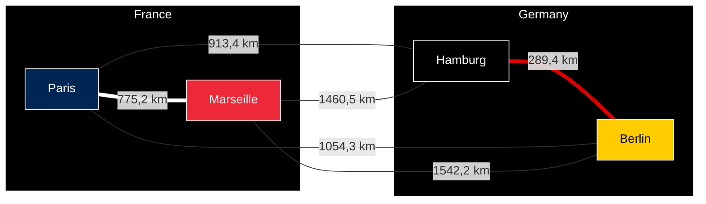

# Travelling Salesman Problem


[](https://github.com/clementreiffers/travelling_salesman_problem/actions/workflows/node.js.yml)

Travelling Salesman Problem system, made in functional programming Javascript with Ramda.

## Overview

1. [Description](#description)
    1. [Travelling Salesman Problem](#travelling-salesman-problem)
    2. [App Description/Implementation](#app-descriptionimplementation)
2. [Installation](#installation)
3. [Start the App](#start-the-app)
4. [Output Example](#output-example)
5. [Project Architecture](#project-architecture)
6. [Developer Tools](#developers-tools)
    1. [Auto Run Project](#auto-run-project)
    2. [Unit Test](#unit-test)
    3. [Code Format Test](#code-format-test)
7. [Git Actions](#gitactions)
8. [Authors](#authors)
9. [Special Thanks](#special-thanks)
10. [Links](#links)
    1. [Documentations](#documentations)
    2. [Libraries](#libraries)

## Description

### Travelling Salesman Problem

The Travelling Salesman Problem also known as TSP is an NP-hard problem in combinatorial optimization.  
Imagine a set of city disposed on a map, you have a set of salesman (population) and they must all
go to every city in the least amount of time/distance.  
The optimization solution is the one where a salesman goes through all the cities with the least
distance or/and time.

In the schema below you can see an example with some cities in Europe (Paris, Marseille, Berlin, Hamburg).
Going from a city to another take more or less time than other depending on the distance.

The Travelling Salesman Problem can find the most optimized path to join all cities.

> **WARNING**
> This code below shows how it works, it will be well printed by seeing this 
> [GitHub Repository](https://github.com/clementreiffers/travelling-salesman-problem)



### App description/implementation

To implement the travelling salesman problem we use genetic algorithm.

Step order:

1. Generate a population where every salesman (individual) has a list of city he goes through.

2. Mutate the population (20% chance of happening on every individual).

3. Crossover the population to create 40% of new individuals that will replace 40% of the old one. An offspring inherits
   all cities from its first parent and a chance of 20% to inherits a city from its second parent.

4. Repair all individuals which pass through a city more than one time.

5. Calculate the score of all individuals. The score is calculated by the addition of all values of all cities.
   All individuals have a different score because the calculation is limited by a max distance. If the max distance is
   greater than the sum of all cities, all individuals would have the same score.

6. Show the best score among all the population.

7. Reiterates all the previous steps N times with the new mutated population.

## Installation

To run the app, you need to install [NodeJS](https://nodejs.org/en/download/)

Once installed, with your terminal go to the folder to the root of the project and run the following commande:

If you're using npm: `npm install`

Or if you're using Yarn: `yarn install`

It will install all the needed libraries to start the project.

## Start the app

After just start the program by typing: `npm start` or `yarn start`

## Output example

```text
all Cities : 
 {
  '0': { x: 32, y: 12, value: 7 },
  '1': { x: 31, y: 47, value: 28 },
  '2': { x: 21, y: 47, value: 46 },
  '3': { x: 6, y: 33, value: 48 },
  '4': { x: 4, y: 29, value: 5 },
  '5': { x: 5, y: 0, value: 6 },
  '6': { x: 11, y: 28, value: 23 },
  '7': { x: 9, y: 39, value: 28 },
  '8': { x: 12, y: 37, value: 9 },
  '9': { x: 47, y: 24, value: 4 },
  '10': { x: 16, y: 10, value: 0 },
  '11': { x: 23, y: 4, value: 43 },
  '12': { x: 27, y: 17, value: 8 },
  '13': { x: 11, y: 33, value: 16 },
  '14': { x: 4, y: 43, value: 36 },
  '15': { x: 46, y: 40, value: 38 },
  '16': { x: 12, y: 42, value: 46 },
  '17': { x: 28, y: 0, value: 21 },
  '18': { x: 41, y: 36, value: 6 },
  '19': { x: 4, y: 9, value: 17 },
  '20': { x: 31, y: 23, value: 2 },
  '21': { x: 47, y: 49, value: 8 },
  '22': { x: 4, y: 26, value: 15 },
  '23': { x: 20, y: 27, value: 35 },
  '24': { x: 49, y: 17, value: 4 },
  '25': { x: 19, y: 38, value: 42 },
  '26': { x: 18, y: 10, value: 49 },
  '27': { x: 48, y: 49, value: 45 },
  '28': { x: 21, y: 16, value: 24 },
  '29': { x: 19, y: 6, value: 8 },
  '30': { x: 15, y: 13, value: 22 },
  '31': { x: 8, y: 41, value: 39 },
  '32': { x: 39, y: 19, value: 33 },
  '33': { x: 6, y: 25, value: 2 },
  '34': { x: 47, y: 37, value: 17 },
  '35': { x: 25, y: 20, value: 10 },
  '36': { x: 22, y: 39, value: 38 },
  '37': { x: 49, y: 36, value: 20 },
  '38': { x: 1, y: 39, value: 43 },
  '39': { x: 26, y: 21, value: 2 },
  '40': { x: 36, y: 6, value: 40 },
  '41': { x: 25, y: 41, value: 44 },
  '42': { x: 11, y: 30, value: 27 },
  '43': { x: 20, y: 22, value: 43 },
  '44': { x: 44, y: 17, value: 44 },
  '45': { x: 34, y: 20, value: 15 },
  '46': { x: 35, y: 44, value: 37 },
  '47': { x: 39, y: 23, value: 48 },
  '48': { x: 32, y: 40, value: 48 },
  '49': { x: 26, y: 12, value: 31 },
  max: 50
}
Best result 1st iteration : {
  path: [
    10, 35, 46, 23, 34,  1, 15,  8, 32, 22, 40,
     9,  3,  7, 36, 28, 13, 38, 26, 11, 16, 48,
     5, 37, 49,  0, 27, 42,  4, 14, 43, 47,  6,
    39, 45, 44, 20, 25, 17, 18, 41, 21,  2, 24,
    19, 12, 31, 33, 30, 29
  ],
  score: 649
}
Best result after 100 iterations {
  path: [
     8, 46, 25,  7, 14, 38,  0, 40, 37, 44, 19,
    30, 22,  3, 36, 43,  6, 45, 28, 23, 41, 47,
    31, 16,  2, 42, 13, 11, 49, 26, 17, 35, 33,
    21, 10, 15, 34, 20, 48, 24, 12, 39, 32, 27,
     5, 18,  1,  4, 29,  9
  ],
  score: 996
}

```

## Project architecture

|                       | **Location** |
|-----------------------|--------------|
| **Source code**       | root         |
| **Gulpfile**          | root         |
| **Unit test scripts** | test folder  |

The Source code is at the root folder and contains the TSP.  
The gulpfile is an auto-run script to run the TSP.  
The unit test scripts are a set of scripts to verify the good behaviour of some functions.

## Developers tools

The project is set with some tools like auto run (gulp), unit
test ([Chai](https://www.chaijs.com/), [Mocha](https://mochajs.org)), code
formatter ([Xo](https://github.com/xojs/xo)/[Prettier](https://prettier.io)).

### Auto run project

The project has a gulpfile to autorun the script while programming.
To install gulp type the following command:
`npm install --global gulp-cli` or `yarn add gulp-cli`

To start it types in the root folder the command: `gulp`

Each time a js script is modified and save, it will run the example.js file.  
The gulp file is written in js.

### Unit test

To run the unit test scripts, you can type the command: `npm test` or `yarn test`

It will start [Mocha](https://mochajs.org) that will look for test scripts.  
The test scripts are written in js with [Chai](https://www.chaijs.com/).
Take note that GitHub verify the correct work of the tests.

### Code format test

You can test the format code of the project by typing the following command:
`npm run code-style` or `yarn run code-style`

> **Warning**
> To easily achieve the code format test, you should use [Prettier](https://prettier.io)
> for [Xo (code formater wraper)](https://github.com/xojs/xo) code-formatting that is already set with some
> parameters in the project

## GitActions

[](https://github.com/clementreiffers/travelling_salesman_problem/actions/workflows/node.js.yml)

The project is set with GitHub Actions that will test:

- code format and functions not used ([Xo](https://github.com/xojs/xo))

- unit test scripts ([Chai](https://www.chaijs.com/) and [Mocha](https://mochajs.org))

If one of those test failed a mail is sent to the person who tried to merge its code from
the staging to main branch.

## Authors

- [Clément Reiffers](https://github.com/clementreiffers)
- [Quentin Morel](https://github.com/Im-Rises)

## Special thanks

- [Maxime Robin](https://github.com/Waxo)

## Links

### Documentations

- [What is Travelling Salesman Problem?](https://en.wikipedia.org/wiki/Travelling_salesman_problem)
- [Understand what is a genetic algorithm](https://www.youtube.com/watch?v=ncj_hBfRt-Y>)

### Libraries

- [Node and npm (runtime environment and software packaging system)](https://nodejs.org/)
- [Yarn (software packaging system)](https://classic.yarnpkg.com/lang/en)
- [Ramda (functional programming library in JS)](https://ramdajs.com)
- [Gulp (auto script starter)](https://gulpjs.com)
- [Chai (assertion library)](https://www.chaijs.com/)
- [Mocha (test framework)](https://mochajs.org)
- [Xo (code formater wraper)](https://github.com/xojs/xo)
- [Prettier (code formatter)](https://prettier.io)
- [Editor config (normalize the IDE for the project)](https://EditorConfig.org)
- [Mermaid (Graph shown in Readme)](https://mermaid.js.org)

### Other

- [GitHub Badges](https://github.com/aleen42/badges)

[](https://github.com/clementreiffers/travelling-salesman-problem/graphs/contributors)
